

  
  
  # 30DaysOfCSS
  Completing 30 CSS project challenges in 30 days

## About

This project was created by <a href="https://github.com/MilenaCarecho/30diasDeCSS" >MilenaCarecho</a> which aims to improve the knowledge of CSS animations and effects without any framework.  
Some of the ideas was from playlists of <a href="https://www.youtube.com/playlist?list=PL5e68lK9hEzcZLltZrc3NDlKWS3XygchY"> CSS animation effects </a> , thanks for all the help!

## Goal

Enhance my CSS skills to develop visually distinctive components with engaging animations, creating a more dynamic and interactive user experience.

## Summary

n°  | Challenges 
:--:|:--------------------------------------------------------|
1   | [Day 01 - Passing through divs](#id01)
2   | [Day 02 - Animated loader](#id02)
3   | [Day 03 - Layered social media icon](#id03)
4   | [Day 04 - Toggle color change](#id04)
5   | [Day 05 - Loading Animation](#id05)
6   | [Day 06 - Animation hover navbar](#id06)
7   | [Day 07 - Typewriter](#id07)
8   | [Day 08 - Animated menu](#id08)
9   | [Day 09 - Water effect](#id09)
10  | [Day 10 - Fireworks](#id10)
11  | [Day 11 - Animated search box](#id11)
12  | [Day 12 - Neon Button](#id12)
13  | [Day 13 - Lighting text effect](#id13)
14  | [Day 14 - Pulsing effect](#id14)
15  | [Day 15 - Preloader animation](#id15)
16  | [Day 16 - Floating text](#id16)
17  | [Day 17 - Button effect](#id17)
18  | [Day 18 - Floating Leaves effect](#id18)
19  | [Day 19 - Disc aligment](#id19)
20  | [Day 20 - Square of dots](#id20)
21  | [Day 21 - Preloader squares animation](#id21)
22  | [Day 22 - Responsive menu with media queries](#id22)
23  | [Day 23 - Icon background effect](#id23)
24  | [Day 24 - 3D rotating square](#id24)
25  | [Day 25 - Smoke animation](#id25)
26  | [Day 26 - Rotating animation square](#id26)
27  | [Day 27 - Share button tooltip](#id27)
28  | [Day 28 - Social media buttons hover](#id28)
29  | [Day 29 - Year cube](#id29)
30  | [Day 30 - Floating lighting cube](#id30)

## Day 01 - Passing through divs 

  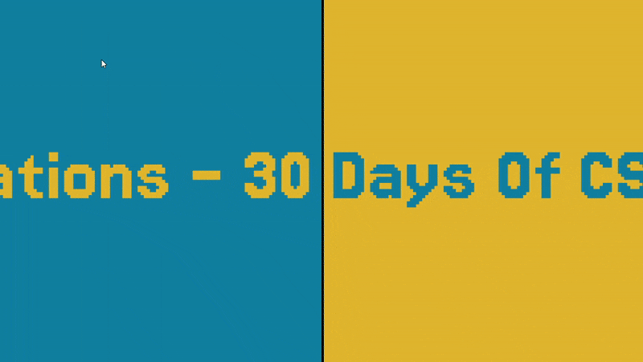

- [My Code](https://github.com/Alicelspires/30DaysCSS/tree/main/01-PassingThroughDivs) 

### What I learned:

- Animation using @keyframes and the transform() properties
- New features such as white spacing and absolute positions

 

## Day 02 - Animated loader 

  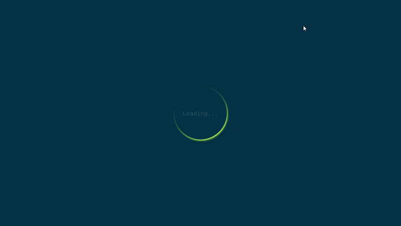

- [My Code](https://github.com/Alicelspires/30DaysCSS/tree/main/02-AnimatedLoader) 

### What I learned:

- Animations
- Transform properties such as rotate()
- Absolute positions

 

## Day 03 - Layered Icons 

  

- [My Code](https://github.com/Alicelspires/30DaysCSS/tree/main/03-LayeredIcons) 

### What I learned:

- :nth-child()
- Transform properties such as rotate(), skew() and translate()
- Absolute positions
- ::before and ::after

 

## Day 04 - Toggle color change 

  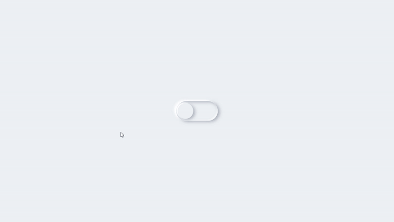

- [My Code](https://github.com/Alicelspires/30DaysCSS/tree/main/04-ToggleColorChange)

### What I learned:

- :checked
- General sibling selectors (~)
- Cubic-benzier
- Work with a lot of shadows to achieve an amazing effect
- ::before and ::after
- Transitions

 

## Day 05 - Loading Animation 

  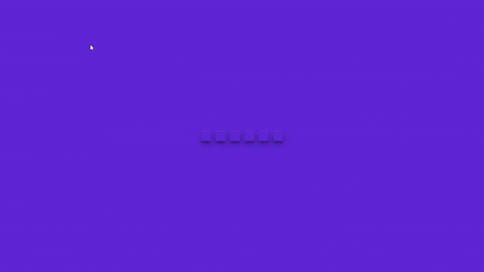

- [My Code](https://github.com/Alicelspires/30DaysCSS/tree/main/05-LoadingAnimation) 

### What I learned:

- :nth-child()
- Transform properties such as scale()
- Animation delay

 

## Day 06 - Animation Hover Navbar 

  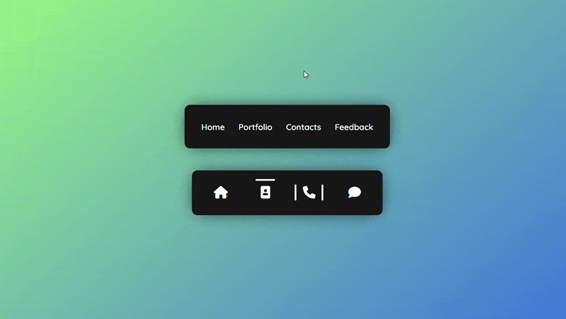

- [My Code](https://github.com/Alicelspires/30DaysOfCSS/tree/main/06-AnimationHoverNavbar)

### What I learned:

- :nth-child()
- Transform properties such as scale()
- Transitions
- Transform-delay
- ::before and ::after
- Absolute positions

 

## Day 07 - Typewriter 

  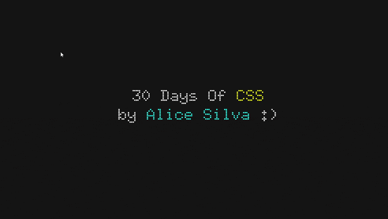

- [My Code](https://github.com/Alicelspires/30DaysOfCSS/tree/main/07-Typewriter)

### What I learned:

- :nth-child()
- Animations

 

## Day 08 - Animated Menu 

  

- [My Code](https://github.com/Alicelspires/30DaysOfCSS/tree/main/08-AnimatedMenu)

### What I learned:

- :nth-child()
- Animations
- Transform properties such as rotate()
- Transitions
- Absolute positions

 

## Day 09 - Water Effect 

  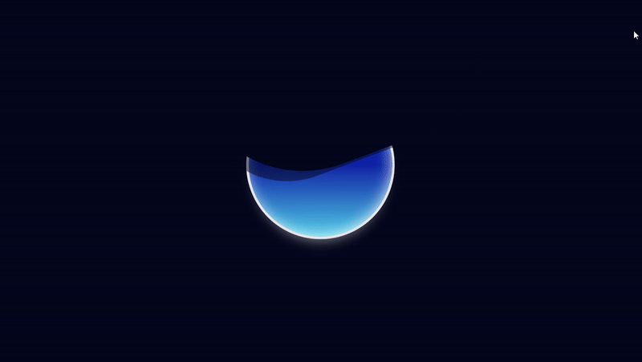

- [My Code](https://github.com/Alicelspires/30DaysOfCSS/tree/main/09-WaterEffect)

### What I learned:

- ::before and ::after
- Animations
- Transform properties such as rotate() and translate()
- Absolute positions

 

## Day 10 - Fireworks 

  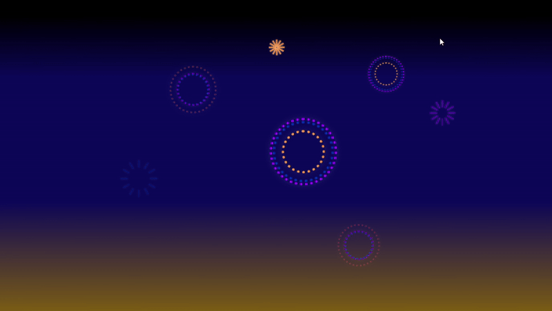

- [My Code](https://github.com/Alicelspires/30DaysOfCSS/tree/main/10-Fireworks)

### What I learned:

- ::before and ::after
- @Keyframes
- Transform properties such as rotate() and translate()
- Absolute positions
- Usage of calc() and var() functions

 

## Day 11 - Animated Search Box 

  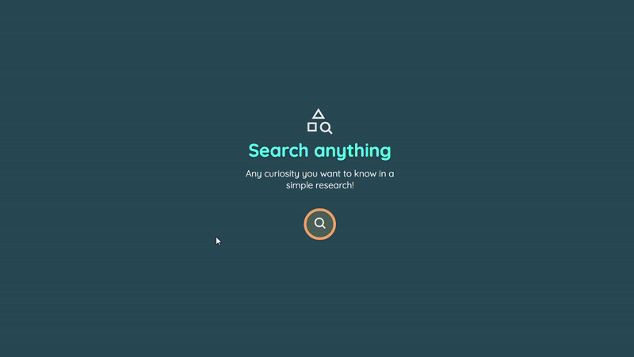

- [My Code](https://github.com/Alicelspires/30DaysOfCSS/tree/main/11-AnimatedSearchBox)

### What I learned:

- Transitions
- hovers
- Absolute positions

 

## Day 12 - Neon button 

  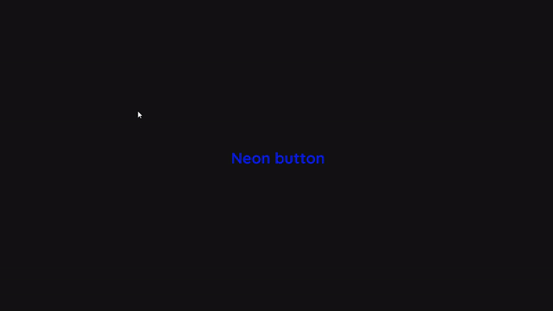

- [My Code](https://github.com/Alicelspires/30DaysOfCSS/tree/main/12-NeonButton)

### What I learned:

- Transitions
- hovers
- Absolute positions
- :nth-child()

 

## Day 13 - Lightining Text Effect 

  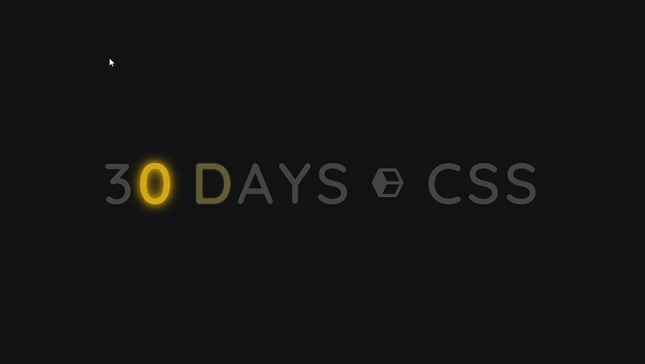

- [My Code](https://github.com/Alicelspires/30DaysOfCSS/tree/main/13-LightingTextEffect)

### What I learned:

- @keyframes
- Absolute positions
- :nth-child()

 

## Day 14 - Pulsing Effect 

  

- [My Code](https://github.com/Alicelspires/30DaysOfCSS/tree/main/14-PulsingeEffect)

### What I learned:

- @keyframes
- Transitions
- Absolute positions
- ::before and ::after
- Animation
- Transform properties such as skew() and scale()

 

## Day 15 - Preloader Animation 

  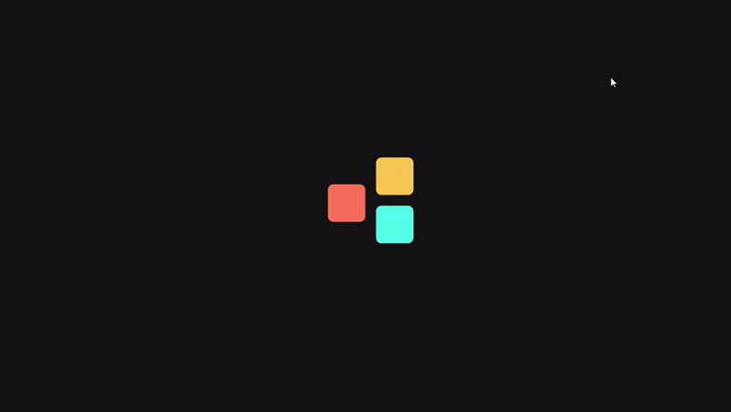

- [My Code](https://github.com/Alicelspires/30DaysOfCSS/tree/main/15-PreloaderAnimation)

### What I learned:

- @keyframes
- Animation delays
- Absolute positions
- :nth-child()
- Transform properties such as translate()

 

## Day 16 - Floating Text 

  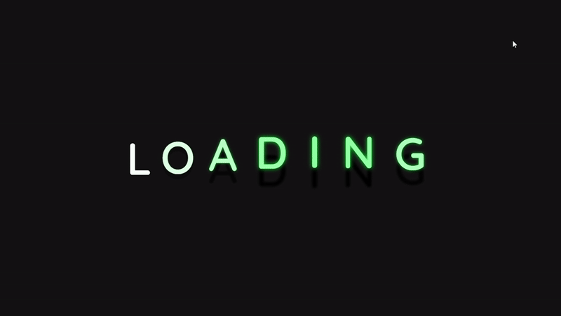

- [My Code](https://github.com/Alicelspires/30DaysOfCSS/tree/main/16-FloatingText)

### What I learned:

- @keyframes
- Animation delays
- calc() and var() properties
- Transform properties such as translate()

 

## Day 17 - Button Effect 

  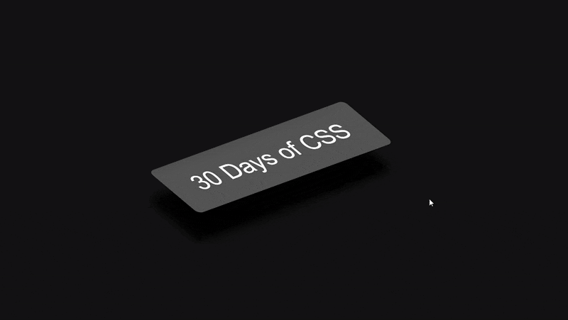

- [My Code](https://github.com/Alicelspires/30DaysOfCSS/tree/main/17-ButtonEffect)

### What I learned:

- :hover
- Transform properties such as translate() and skew()
- Absolute position

 

## Day 18 - Floating Leaves Effect 

  

- [My Code](https://github.com/Alicelspires/30DaysOfCSS/tree/main/18-FloatingLeavesEffect)

### What I learned:

- @keyframes
- :nth-child()
- Transform properties such as translate(), skew() and rotate()
- Absolute position
- Animation-delay
- Filter blur()

 

## Day 19 - Disc Aligment 

  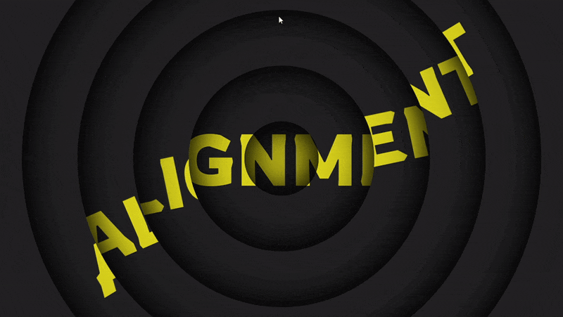

- [My Code](https://github.com/Alicelspires/30DaysOfCSS/tree/main/19-DiscAlignment)

### What I learned:

- @keyframes
- :nth-child()
- Transform properties such as rotate()
- Absolute position
- Animation-delay
- cubic-benzier()

 

## Day 20 - Square of Dots 

  

- [My Code](https://github.com/Alicelspires/30DaysOfCSS/tree/main/20-SquareOfDots)

### What I learned:

- @keyframes
- calc() and var() properties
- Transform properties such as scale()
- Animation-delay

 

## Day 21 - Pile of Blocks 

  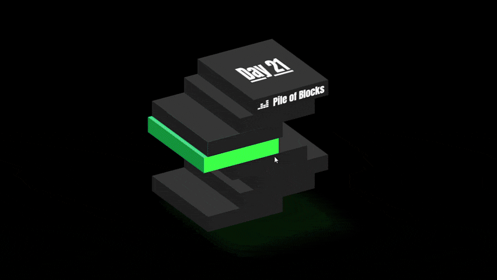

- [My Code](https://github.com/Alicelspires/30DaysOfCSS/tree/main/21-PileOfBlocks)

### What I learned:

- @keyframes
- Transform properties such as translate() and skew()
- Absolute position
- Animation-delay
- Filter hue-rotate()
- calc() and var() properties
- Transform-origem
- :nth-child()
- ::before and ::after

 

## Day 22 - Responsive Menu Media Queries 

  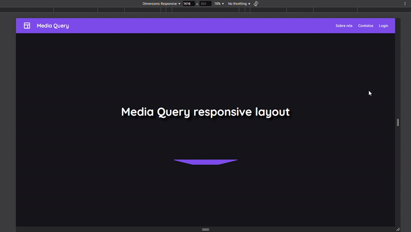

- [My Code](https://github.com/Alicelspires/30DaysOfCSS/tree/main/22-ResponsiveMenuMediaQueries)

### What I learned:

- @keyframes
- @media()

 

## Day 23 - Icon Background Effect 

  

- [My Code](https://github.com/Alicelspires/30DaysOfCSS/tree/main/23-IconBackgroundEffect)

### What I learned:

- @keyframes
- Animation-delay
- Transform properties such as skew(), rotate() and translate()

 
